# 软件测试复习

## 第一章：引论

> 了解：|

### 1.2 为什么要进行软件测试

- 软件测试——产品**质量**的保证
- 软件测试——控制**成本**的关键
- 软件测试——软件**可靠性**确认
- 软件测试——让企业具备国际竞争的实力

### 1.3 什么是软件测试

**Bill Hetzel博士（正向思维的代表）：**

- 软件测试就是为程序能够按预期设想那样运行而建立足够的信心。
- "软件测试是一系列活动以评价一个程序或系统的特性或能力并确定是否达到预期的结果"
- 测试是为了验证软件是否符合用户需求，即验证软件产品是否能正常工作

**Glenford J. Myers（反向思维的代表）：**

- 测试是为了证明程序有错，而不是证明程序无错误
- 一个好的测试用例是在于它能发现至今未发现的错误
- 一个成功的测试是发现了至今未发现的错误的测试

**软件测试4种导向**

- 以功能验证为导向，测试是证明软件是正确的（正向思维）
- 以破坏性检测为导向，测试是为了找到软件中的错误（逆向思维）
- 以*质量评估*为导向，测试是提供产品的评估和质量度量
- 以*缺陷预防*为导向，测试是为了展示软件符合设计要求，发现缺陷、预防缺陷

***软件测试：是由"验证（Verification）"和"有效性确认（Validation）"活动构成的整体***

- "验证"是检验软件是否已正确地实现了产品规格书所定义的系统功能和特性
- "有效性确认"是确认所开发的软件是否满足用户真正需求的活动。

### 1.4 软件测试和软件开发的关系

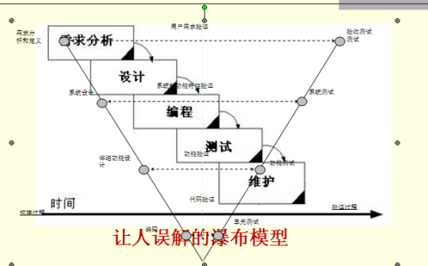

**SQA**

软件质量保证（SQA）活动是通过对软件产品有计划的进行评审和审计来验证软件是否合乎标准的系统工程，通过协调、审查和跟踪以获取有用的信息，
形成分析结果以指导软件过程

**软件测试与SQA的关系**

- 关系：
  - SQA 指导、监督软件测试的计划和执行，督促测试工作的结果客观、准确和有效，并协助测试流程的改进
  - 软件测试是 SQA 重要的手段之一，为 SQA 提供所需的数据，作为质量评价的客观依据
- 区别：
  - SQA 是一项管理工作，侧重于对流程的评审和监控
  - 测试是一项技术性的工作，侧重对产品进行评估和验证

> 软件测试   4种导向  5大学派

## 第二章：软件测试的基本概念

> 了解：

### 2.1 软件缺陷定义

- 从产品内部看，软件缺陷是软件产品**开发或维护**过程中所存在的**错误、毛病**等各种问题；
- 从外部看，软件缺陷是**系统**所需要实现的某种**功能的失效或违背**

### 2.2 修复软件缺陷的代价

- 在设计阶段就是它的3～6倍，在编程阶段是它的10倍，在内部测试阶段是它的20～40倍；
- 在外部测试阶段是它的30～70倍，而到了产品发布出去时，这个数字就是40～1000倍；
- **修正错误的代价不是随时间线性增长，而几乎是呈指数增长的**。
- 

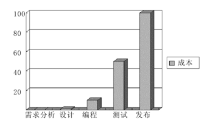

### 2.3 结束标准

- 用例全部测试
- 覆盖率达到标准
- 缺陷率达到标准
- 其他指标达到标准

> 掌握：

### 2.4 软件测试的分类

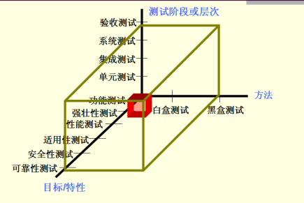

#### 压力测试

也称负载测试，用来检查系统在不同负载条件下的系统运行情况，特别是高负载、极限负载的系统运行情况，以发现系统不稳定性、系统性能
瓶颈、内存泄漏、CPU 使用率过高等问题

#### 回归测试

为保证软件中新的变化（新增加的代码、代码修改等）不会对原有功能的正常使用有影响而进行的测试。也就是，满足用户需求的原有功能不应该因为代码变化而出现任何新的问题

#### 静态测试和动态测试：

**静态测试：**

- 静态测试就是静态分析，对模块的源代码进行研读，查找错误或收集一些度量数据，并不需要对代码进行编译和仿真运行。
- 静态测试包括对软件产品的需求和设计规格说明书评审、对程序代码的复审等。
- 静态分析的查错和分析功能是其他方法所不能替代的
- ~~可以采用人工检测和计算机辅助静态分析手段进行检测，但越来越多地采用工具进行自动化分析。~~

**动态测试：**

- 动态测试是通过真正运行程序发现错误，通过观察代码运行过程，来获取系统信息，对系统行为进行验证
- ~~动态测试是通过真正运行程序发现错误，通过观察代码运行过程，来获取系统行为、变量实时结果、内存、堆栈、线程以及测试覆盖度等各方面的信息，来判断系统是否存在现缺陷。~~

### 2.5 软件测试的工作范畴

- 软件测试工作的组织与管理：制定测试策略、测试计划，确认所采用的测试方法与规范，控制测试进度，管理测试资源。
- 测试工作的实施：编制符合标准的测试文档，搭建测试环境，开发测试脚本、与开发组织协作实现各阶段的测试活动

## 第三章：软件测试方法！！！！（重点）

> 理解：

### 3.1 白盒测试的概念

白盒测试也称结构测试或逻辑驱动测试，它是按照程序内部的结构测试程序，通过测试来检测产品内部动作是否按照设计规格说明书的规定正常进行，检验程序中的每条通路是否都能按预定要求正确工作。

### 3.2 黑盒测试的概念

黑盒测试也称功能测试，它是通过测试来检测每个功能是否都能正常使用。在测试中，把程序看作一个不能打开的黑盒子，在完全不考虑程序内部结构和内部特性的情况下，在程序接口进行测试，它只检查程序功能是否按照需求规格说明书的规定正常使用，程序是否能适当地接收输入数据而产生正确的输出信息。黑盒测试着眼于程序外部结构，不考虑内部逻辑结构，主要针对软件界面和软件功能进行测试。

### 3.3 什么是测试用例？

为某个特殊目标而编制的一组测试输入、执行条件以及预期结果，以便测试某个程序路径或核实是否满足某个特定需求。指对一项特定的软件产品进行测试任务的描述，体现测试方案、方法、技术和策略。内容包括测试目标、测试环境、输入数据、测试步骤、预期结果、测试脚本等，并形成文档。

### 3.4 为什么要设计测试用例？

- 测试用例构成了设计和制定测试过程的基础。
- 测试的"深度"与测试用例的数量成比例。由于每个测试用例反映不同的场景、条件或经由产品的事件流，因而，随着测试用例数量的增加，对产品质量和测试流程也就越有信心。判断测试是否完全的一个主要评测方法是基于需求的覆盖，而这又是以确定、实施和/或执行的测试用例的数量为依据的。
- 测试工作量与测试用例的数量成比例。根据全面且细化的测试用例，可以更准确地估计测试周期各连续阶段的时间安排。
- 测试设计和开发的类型以及所需的资源主要都受控于测试用例。
- 测试用例通常根据它们所关联关系的测试类型或测试需求来分类，而且将随类型和需求进行相应地改变。最佳方案是为每个测试需求至少编制两个测试用例：
  - 一个测试用例用于证明该需求已经满足，通常称作正面测试用例；
  - 另一个测试用例反映某个无法接受、反常或意外的条件或数据，用于论证只有在所需条件下才能够满足该需求，这个测试用例称作负面测试用例。
- **测试用例是软件测试的核心**

> 掌握：

### 3.5 白盒测试方法的分类

语句覆盖、条件覆盖、判定覆盖、判定条件覆盖、条件组合覆盖、基本路径覆盖

- **语句覆盖**：语句覆盖法的基本思想是设计若干测试用例，运行被测程序，使程序中的每个**可执行语句至少被执行一次；**
- **判定覆盖**：判定覆盖法的基本思想是设计若干用例，运行被测程序，使得程序中每个判断的取**真分支**和取**假分支**至少经历一次，即判断真假值均曾被满足；
- **条件覆盖**：条件覆盖的基本思想是设计若干测试用例，执行被测程序以后，要使每个判断中**每个条件**（判断由多个条件组成）**的****可能取值**至少满足一次；

  - **条件覆盖**关注的是判断语句中每个**单独条件**的真假值，而不是整个判断的结果。
  - `if (A > 5 && B < 10)`为例：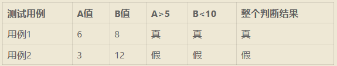
- 判定-条件覆盖：**判定覆盖 and 条件覆盖**（判定和条件覆盖设计方法的交集）；
- 条件组合覆盖（**一条语句内的条件组合**）：每个判定表达式中条件的**各种可能组合**都至少出现一次；
- 路径覆盖：每条可能的**路径**（至少一条边不同）都至少执行一次，若图中有环，则每个环至少经过一次；

**例子**：

  

    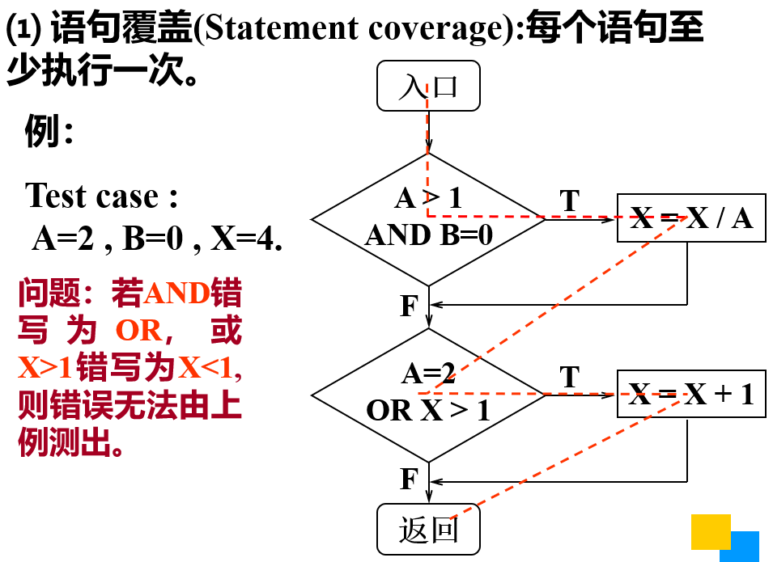
  

  

    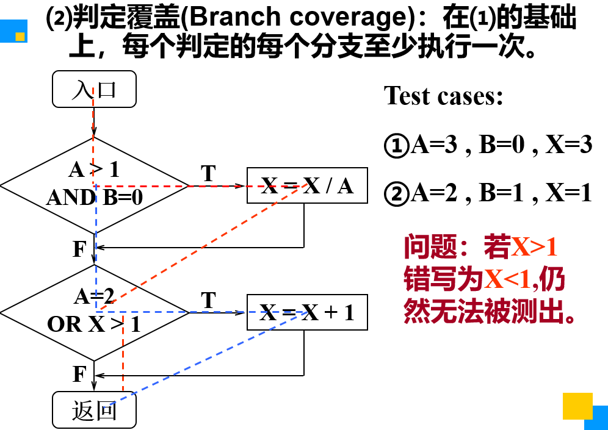
  

  

    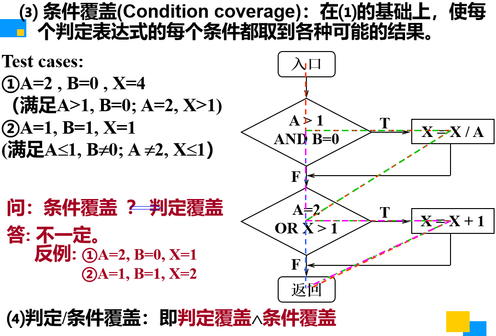
  

  

    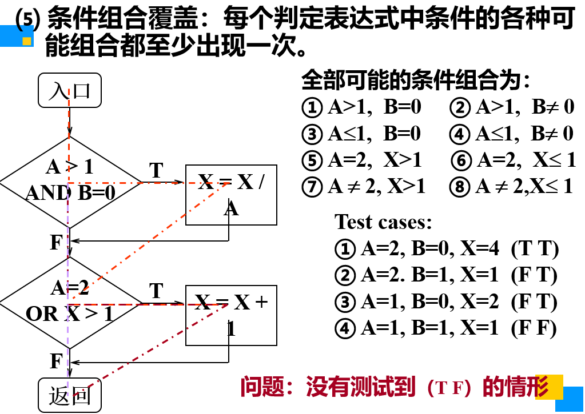
  

  

    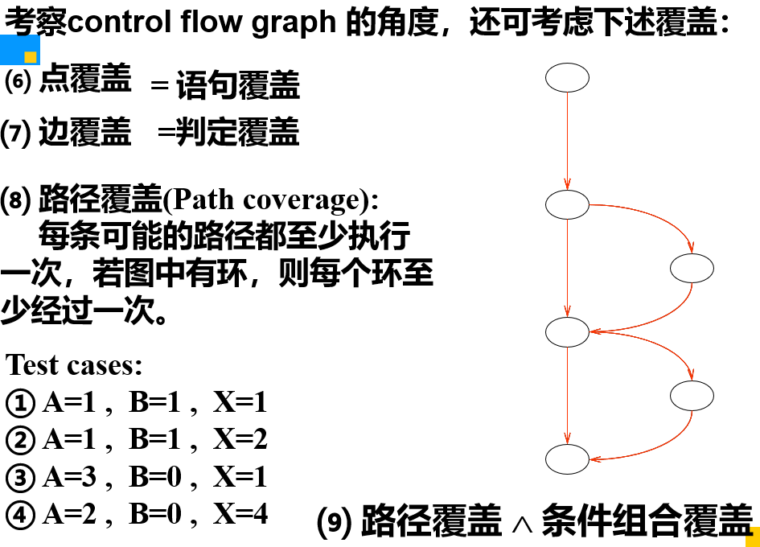
  

#### 基本路径测试法 （！！！！一定要掌握）

设计所有的测试用例，来覆盖程序中的所有可能的**执行路径**

- 求环路复杂度的3种方法

  - 圈复杂度：代码逻辑复杂度的度量，提供了被测代码的路径数量；复杂度越高，出错的概率越大。
  - V(G) = 区域数量(由节点、连线包围的区域，包括图形外部区域)
  - V(G) = 连线数量 - 节点数量 + 2
  - V(G) = 简单可预测节点数量（判断节点数目） + 1
- 为什么需要求环路复杂度

  - ~~程序的环路复杂性给出了程序基本路径集合中的**独立路径条数**~~, 确定独立路径的数量
  - 这是确保程序中每个**可执行语句*****至少***执行一次所必需的~~测试**用例数目的上界**~~
- 构造基本路径集合的方法

  **例子**：
  基本路径测试是在*程序控制流图*的基础上，分析控制构造的环路复杂性，导出基本可执行路径集合，设计测试用例的方法。

  

    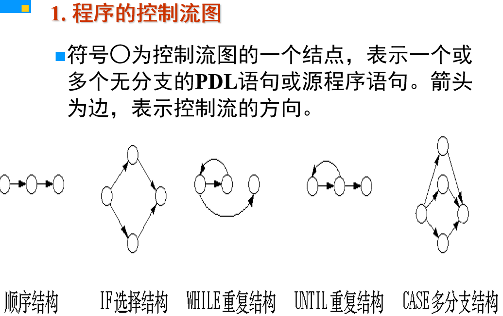
  

  

    <strong>规则：</strong>
    <ul>
      <li>在选择或多分支结构中，分支的汇聚处应有一个汇聚结点。</li>
      <li>边和结点圈定的区域叫做区域，当对区域计数时，图形外的区域也应记为一个区域。</li>
      <li>如果判断中的条件表达式是由一个或多个逻辑运算符 (OR, AND, NAND, NOR) 连接的复合条件表达式，则需要改为一系列只有单个条件的嵌套的判断。</li>
    </ul>
  

  

    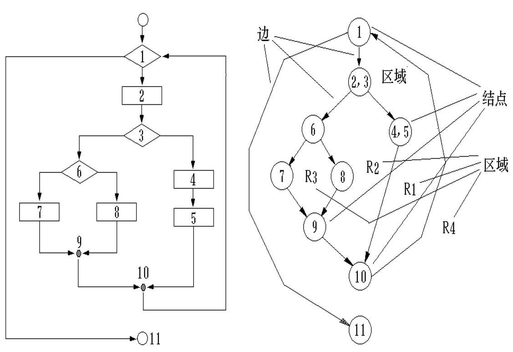
  

  

    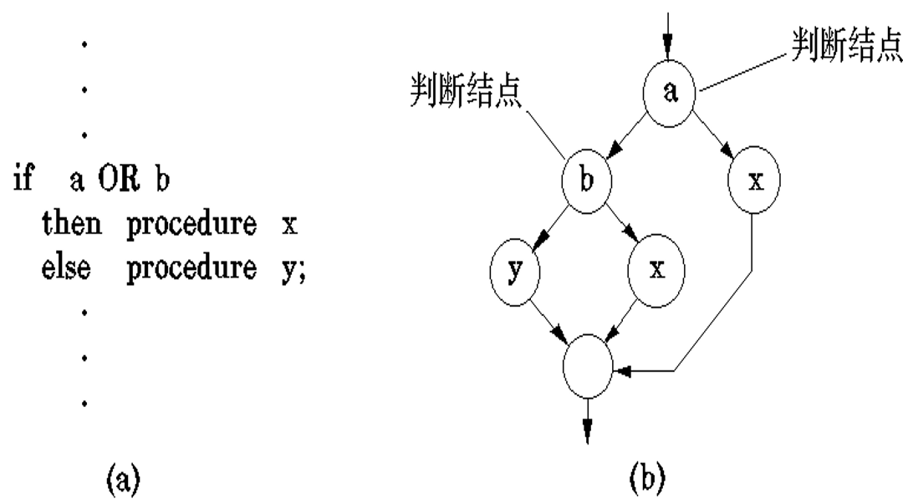
  

### 3.6 黑盒测试方法的分类

判定表方法、因果图法、正交试验法、功能图法、等价类划分法、边界值分析法、错误推断法

- **等价类划分法**（等价分类法）：分为有效等价类和无效等价类。

  - *有效等价类*是有意义的、合理的输入数据，可检查程序是否实现了规格说明中所规定的功能和性能。
  - *无效等价类*与有效等价类的意义相反
- **边界值分析法**：大量的错误是发生在输入或输出范围的边界上，而不是在输入范围的内部

  - 确定边界情况（输入或输出等价类的边界）
  - 选取正好等于、刚刚大于或刚刚小于边界值作为测试数据
- **因果图法!!**：如果在测试时必须考虑输入条件的各种组合，可使用一种适合于描述对于多种条件的组合，相应产生多个动作的形式来设计测试用例，这就需要利用因果图
- 判定表法!!!：因果图方法最终生成的就是判定表。它适合于检查程序输入条件的各种组合情况。

#### 因果图法步骤

**用因果图生成测试用例的基本步骤：**

| 步骤 | 内容                     | 详细说明                                                                                                                                                          |
| ---- | ------------------------ | ----------------------------------------------------------------------------------------------------------------------------------------------------------------- |
| 1    | **分析原因和结果** | • 分析软件规格说明描述中，哪些是**原因**（即输入条件或输入条件的等价类） • 哪些是**结果**（即输出条件） • 给每个原因和结果赋予一个标识符 |
| 2    | **绘制因果图**     | • 分析软件规格说明描述中的语义 • 找出原因与结果之间、原因与原因之间的关系                                                                                  |
| 3    | **标明约束条件**   | • 由于语法或环境限制，有些原因与原因之间、原因与结果之间的组合情况不可能出现 • 在因果图上用记号标明约束或限制条件                                          |
| 4    | **转换成判定表**   | • 把因果图转换成判定表                                                                                                                                           |
| 5    | **设计测试用例**   | • 把判定表的每一列拿出来作为依据，设计测试用例                                                                                                                   |

  

    <strong>因果图基本符号：</strong>
    <ul>
      <li><strong>恒等</strong>：如果原因出现，则结果出现；如果原因不出现，则结果不出现</li>
      <li><strong>非</strong>：如果原因出现，则结果不出现；如果原因不出现，则结果出现</li>
      <li><strong>或</strong>：如果几个原因中的任何一个出现，则结果出现</li>
      <li><strong>与</strong>：如果几个原因同时出现，则结果才出现</li>
    </ul>
    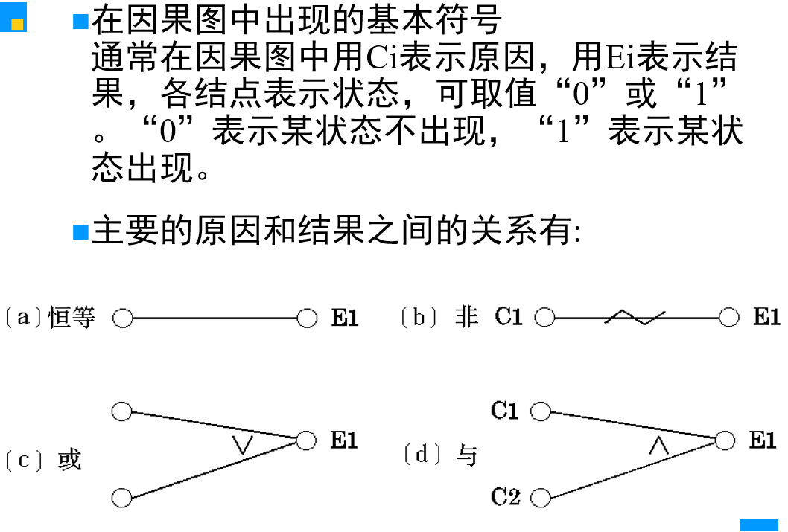
  

  

    <strong>约束符号：</strong>
    <ul>
      <li><strong>E（异）</strong>：a和b中最多有一个可能为1，不能同时为1</li>
      <li><strong>I（或）</strong>：a、b、c中至少有一个必须为1，不能全为0</li>
      <li><strong>O（唯一）</strong>：a和b中必须有一个，且仅有一个为1</li>
      <li><strong>R（要求）</strong>：a是1时，b必须是1，即a出现时b必须出现与原因之间对应的关系</li>
    </ul>
    
根据这些关系，画出因果图

    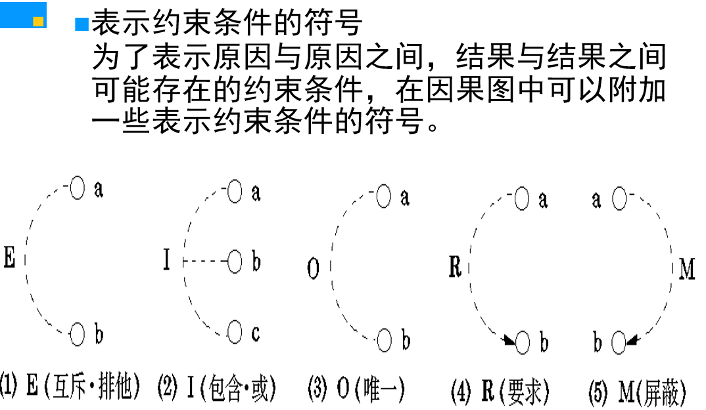
  

**例子：**
例如，有一个处理单价为5角钱的饮料的自动售货机软件测试用例的设计。其规格说明如下：
若投入5角钱或1元钱的硬币，押下〖橙汁〗或〖啤酒〗的按钮，则相应的饮料就送出来。若售货机没有零钱找，则一个显示〖零钱找完〗的红灯亮，这时在投入1元硬币并押下按钮后，饮料不送出来而且1元硬币也退出来；若有零钱找，则显示〖零钱找完〗的红灯灭，在送出饮料的同时退还5角硬币。”

  

    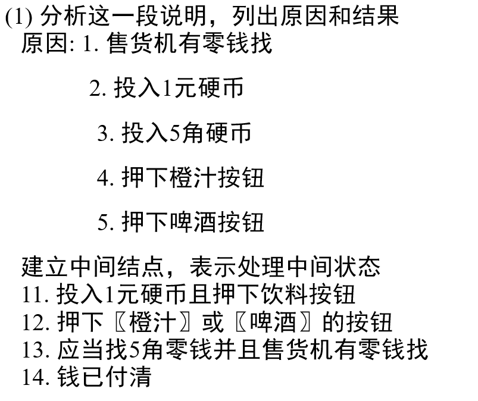
  

  

    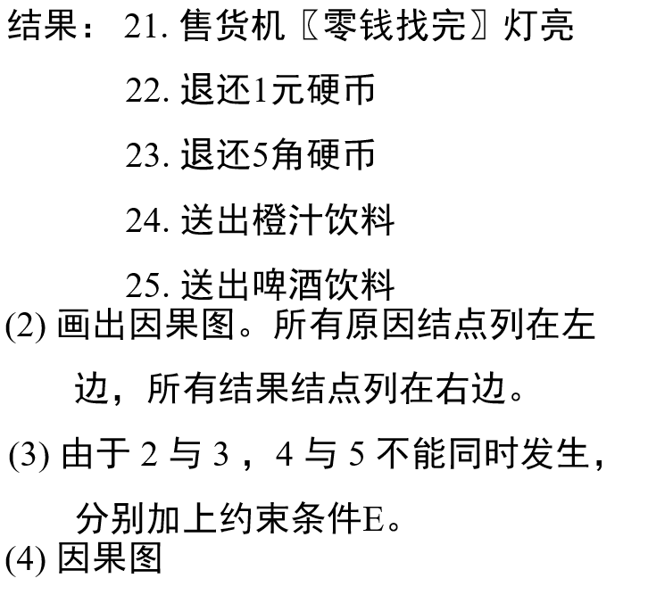
  

  

    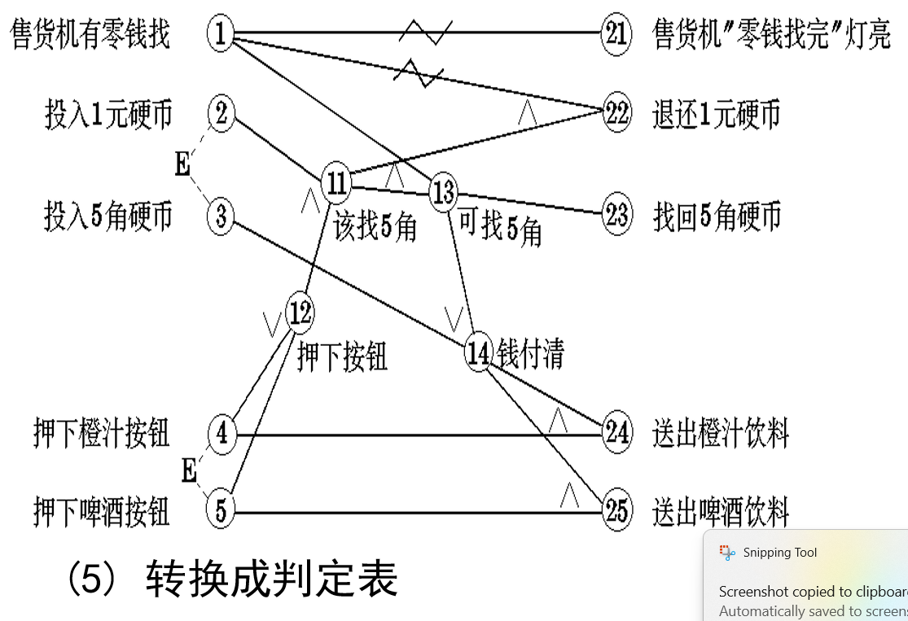
  

  

    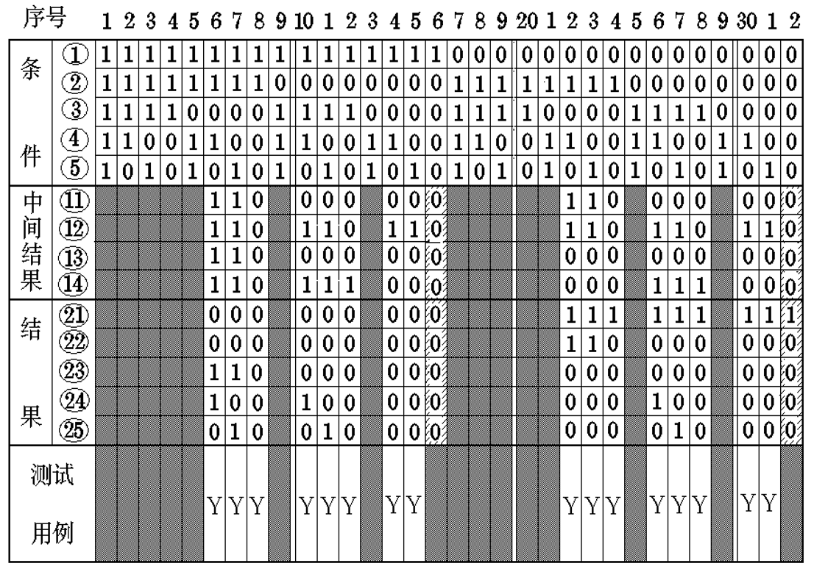
  

#### 判定表方法步骤：

- 条件桩：列出问题的所有条件
- 动作桩：列出可能针对问题所采取的操作
- 条件项：针对所列条件的具体赋值
- 动作项：列出在条件项（各种取值）组合情况下应该采取的动作

**规则：任何一个条件组合的特定取值及其相应要执行的操作**

判定表方法步骤：

1. 列出条件桩
2. 列出动作桩
3. 填入条件项及其组合
4. 填入动作项，制定初始判定表
5. 简化、合并相似规则或者相同动作

**例子**：

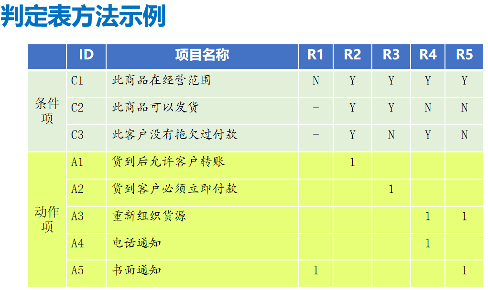

---

**以上设计测试用例的方法一定要掌握**

- **用条件覆盖法设计白盒测试用例**
- **用等价类和边界值设计黑盒测试用例**

> （？？？）有限自动机  堆栈 的   状态图、状态转化树

## 第四章

> 了解：

### 4.1 TMM

过程能力描述了遵循一个软件测试过程可能达到的预期结果的范围。TMM的建立，得益于以下3点：

- 充分吸收、CMM的精华；
- 基于历史演化的测试过程；
- 业界的最佳实践。

### 4.2 TPI

TPI是基于连续性表示法的测试过程改进的参考模型，是在软件控制、测试知识以及过往经验的基础上开发出来的

### 4.3 CTP

关键测试过程（Critical Test Process，CTP）评估模型主要是一个内容参考模型，一个上下文相关的方法，并能对模型进行裁剪

### 4.4 STEP

STEP（Systematic Test and Evaluation Process，系统化测试和评估过程）是一个内容参考模型，认定测试是一个生命周期活动，在明确需求后开始直到系统退役

### 4.5 W模型！！！！

W 模型：由两个 V 字型模型组成，分别代表测试与开发过程，测试与开 发并行，测试伴随着整个软件开发周期，而且测试的对象不仅是程序，还包括需求定义文档、设计文档等

### 4.6 软件测试5大学派

1. **分析学派**：认为软件是逻辑性的，将测试看作计算机科学和数学的一部分，测试工作是技术性很强的工作
2. **标准学派**：把测试看作侧重成本控制并具有可重复标准的、旨在衡量项目进度的工作
3. **质量学派**：测试是过程的质量控制、揭示项目质量风险的活动，测试人员扮演产品质量的守门员角色
4. **上下文驱动学派**：强调人，测试所发现的每个缺陷都和相关利益者密切相关
5. **敏捷学派**：测试就是验证开发是否完成，强调自动化测试

## 第五章：单元测试 集成测试

> 掌握：单元测试的概念

### 5.1 单元测试的概念

单元测试是对软件基本组成单元（如函数、类的方法等）进行的测试：

- **定义**：单元测试是对软件基本组成单元进行的测试。
- **时机**：一般在代码完成后由开发人员完成，QA人员辅助。
- **概念**：模块、组件、单元
- 单元测试的测试人员：程序人员和开发人员
- 单元测试的**测试方法**

  - 检查每一条独立执行路径的测试。保证每条语句被至少执行一次。
  - 检查局部数据结构完整性
  - 检查模块接口是否正确
  - 检查临界数据处理的正确性
  - 预见、预设的各种出错处理是否正确有效
- **单元测试的依据**：**软件详细说明书**（详细设计和概要设计）
- 单元测试测试的不仅仅是代码，有：接口测试、局部数据结构测试、独立路径测试、独立路径测试、边界条件测试、错误处理测试、功能测试、性能测试、内存使用测试等。

### 5.2 单元测试的主要目标

- 单元模块被正确编码
- 信息能否正确地流入和流出单元；
- 在单元工作过程中，其内部数据能否保持其完整性，包括内部数据的形式、内容及相互关系不发生错误，也包括全局变量在单元中的处理和影响。
- 在为限制数据加工而设置的边界处，能否正确工作。
- 单元的运行能否做到满足特定的逻辑覆盖。
- 单元中发生了错误，其中的出错处理措施是否有效。

---

> 掌握：集成测试的概念

### 5.3 集成测试的概念

- 定义：**集成测试是将软件集成起来，对模块之间的接口进行测试。**
  （~~顾名思义，集成测试是将软件集成起来后进行测试。集成测试又叫子系统测试、组装测试、部件测试等。~~）

  - 模块内的集成，主要是测试模块内各个接口间的交互集成关系；
  - 子系统内的集成，测试子系统内各个模块间的交互关系；
  - 系统内的集成，测试系统内各个子系统和模块间的集成关系。
- 集成测试的**测试人员**：有经验的测试人员和开发者共同
- 集成测试的**集成模式**和经典代表

  - **非渐增式测试模式**：先分别测试每个模块，再把所有模块按设计要求放在一起结合成所要的程序，如大棒模式。
  - **渐增式测试模式**：把下一个要测试的模块同已经测试好的模块结合进来进行测试，测试完后再把下一个应该测试的模块结合起来测试。渐增式测试又可以根据每次添加模块的路线分为**自顶向下测试**、**自底向上测试**和**混合测试**等方式。
- 集成测试的**测试依据**：概要设计书，详细设计说明书，主要是**概要设计说明书**

### 5.4 集成测试的主要目标

集成测试，也叫组装测试或联合测试。在单元测试的基础上，将所有模块按照设计要求（如根据结构图）组装成为子系统或系统，进行集成测试。实践表明，一些模块虽然能够单独地工作，但并不能保证连接起来也能正常的工作。程序在某些局部反映不出来的问题，在全局上很可能暴露出来，影响功能的实现。

**目标在于检验与软件设计相关的程序结构问题**。如数据穿过接口时可能丢失；一个模块与另一个模块可能有由于疏忽的问题而造成有害影响；把子功能组合起来可能不产生预期的主功能；个别看起来是可以接受的误差可能积累到不能接受的程度；全程数据结构可能有错误等。

### 5.5 驱动程序和桩程序

运行单元程序有时需要基于被测单元的接口，开发相应的驱动模块和桩模块：

- 驱动模块（drive）:对底层或子层模块进行测试所编写的调用这些模块的程序。
- 桩模块（stub）： 对顶层或上层模块进行测试所编写的替代下层模块的程序。

## 第六章：系统功能测试

### 6.1 系统测试的概念

系统测试（特征测试）：检验系统所有元素之间协作是否合适，整个系统的性能和功能是否达到要求。其测试内容包括：功能测试，非功能测试与回归测试等。

### 6.2 系统测试的测试人员

软件测试工程师

### 6.3 系统测试的内容

- 功能测试
- 回归测试 （目的：在程序有修改的情况下保证原有的功能正常）
- 非功能性测试

#### 非功能性测试（特征测试）包含内容：

- 性能测试
- 压力测试
- 容量测试
- 安全性测试
- 可靠性测试
- 容错性测试

### 6.4 系统测试的测试依据

需求说明书，概要设计说明书，详细设计说明书，最重要的是**需求说明书**。

### 6.5 确认测试

- 确认测试又称有效性测试。有效性测试是在模拟的环境下，运用黑盒测试的方法，验证被测软件是否满足需求规格说明书列出的需求。
- 任务是验证软件的功能和性能及其他特性是否与用户的要求一致。对软件的功能和性能要求在软件需求规格说明书中已经明确规定，它包含的信息就是软件确认测试的基础。

## 第七章：专项测试

### 7.1 性能测试

性能测试（performance test）就是为了发现系统性能问题或获取系统性能相关指标而进行的测试。一般在真实环境、特定负载条件下，通过工具模拟实际软件系统的运行及其操作，同时监控性能各项指标，最后对测试结果进行分析以确定系统的性能状况。

#### 性能测试目标
- 获取系统性能某些指标数据
- 为了验证系统是否达到用户提出的性能指标
- 发现系统中存在的性能瓶颈，优化系统的性能

#### 负载模式
- 定义：加载的循环次数或持续时间
- 加载的方式或模式，如均匀加载、峰值交替加载等
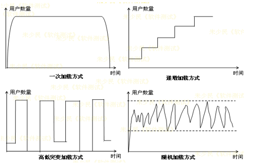

### 7.2 α、β测试

- **α测试**：是指软件开发公司组织内部人员模拟各类用户行对即将面市软件产品（称为α版本）进行测试，试图发现错误并修正。

- **β测试**：经过α测试调整的软件产品称为β版本。紧随其后的β测试是指软件开发公司组织各方面的典型用户在日常工作中实际使用β版本，并要求用户报告异常情况、提出批评意见。然后软件开发公司再对β版本进行改错和完善。

## 第八章：软件本地化测试

- I18N（软件国际化）：：借助功能设计和代码实现中软件系统有能力处理多种语言和不同文化，使创建不同语言版本时，不需要重新编写代码的软件工程方法
- L10N（软件本地化）：将一个软件产品按特定国家/地区或语言市场的需要进行加工，使之满足特定市场上的用户对语言和文化的特殊要求的软件生产活动
- ~~G11N（Globalization）？？？ppt没有~~

## 第九章：软件测试自动化

> 掌握：

### 9.1 测试自动化的内涵

自动化测试（automated test）是相对手工测试而存在的一个概念，由手工逐个地运行测试用例的操作过程被测试工具自动执行的过程所代替。

- *测试工具*的使用是自动化测试的主要*特征*
- 测试自动化指"一切可以由计算机系统自动完成的测试任务都已经由计算机系统或软件工具、程序来承担并自动执行"

### 9.2 测试自动化实现的原理

- **代码分析**：类似于高级编译系统，在工具中定义类/对象/函数/变量等定义规则、语法规则等，在分析时对代码进行语法扫描，找出不符合编码规范的地方。
  
- **对象识别**：
  - Windows 对象
  - Mac 对象
  - Web DOM对象

- **脚本技术**
  - 线性脚本
  - 结构化脚本
  - 数据驱动脚本
  - 关键字驱动脚本

- **自动比较技术**
  - 静态比较和动态比较
  - 简单比较和复杂比较
  - 敏感性测试比较和健壮性测试比较
  - 比较过滤器

- **测试自动化系统的构成：**
  - 测试工具的分类
  - 测试工具的选择
  - 测试自动化普遍存在的问题
  - 自动化测试的引入和应用：
    - 找准测试自动化的切入点
    - 把测试开发纳入整个软件开发体系
    - 测试自动化依赖测试流程和测试用例
    - 软件测试自动化的投入较大
    - 进行资源的合理调度

 -自动化测试框架？？？

> 了解：
- 功能测试工具：QTP
- 性能测试工具：Loadrunner
